# Feldhelfer

![Screenshot vom Startbildschrim der App]{:height="50%" width="50%"}
![Screenshot vom Startbildschrim der App]{:height="50%" width="50%"}

Die App dient dazu Felder von Bauern zu erfassen und darin Schäden zu markieren. Dies geschieht mit einer Android App die ab Version 5.1 lauffähig ist. Sie soll Versicherungen und Bauern helfen Ihre Felder und vor allem die Schäden die in den Felder entstehen besser verwalten zu können als sie es im Moment tun.
Diese App löst vor allem das Problem das man als Versicherung/Bauer häufig nur den Schadensfall auf dem Papier hat und dies unter Umständen deutlich länger dauert ihn zu versenden und zu bearbeiten, als wenn es elektronisch erfasst ist.
Weiter ist es deutlich einfacher den Schaden wieder zu finden, weil man genau auf der Karte sieht wo der Schaden ist und welches Feld betroffen ist.

Wichtig!
Default Anmeldedaten:
Verwalter:
Name: adm
Passwort: 123
Bauer:
Name: farm
Passwort: 000

## Features

### Feature 1 Erstellen von Feldern

Es können Felder auf der Karte mithilfe der Standortsensoren des Handys eingezeichnet werden. Es können aber auch Punkte mithilfe eines Klicks auf den gewünschten Punkt auf der Karte hinzugefügt werden. Ein ungewollt eingezeichneter Eckpunkt kann wieder entfernt werden. Außerdem kann das automatische folgen der Karteposition deaktiviert werden. Weitere Daten können nach dem einzeichnen der Eckpunkte hinzugefügt werden (z.B. Namen des Versicherungsnehmers, Lage des Feldes). Details zur Bedienung folgen nun als Screenshots. Es können auch direkt mehrere Felder hintereinander eingefügt werden.

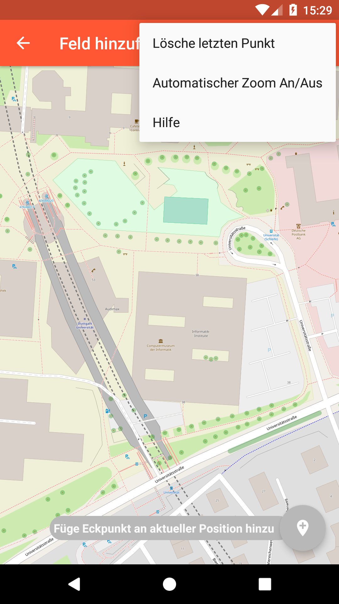
Nachdem klicken auf den + Button in der Main Activity. Weiter sieht man das Menu, das ausgeklappt werden kann, indem man auf die drei Punkte klickt. Mit diesen zwei Buttons kann der zuletzt eingefügte Punkt rückgängig gemacht werden und der Automatische Zoom der Karte deaktiviert/aktiviert werden

Der erste Punkt wurde entweder über GPS, mithilfe des Button rechts unten hinzugefügt oder mit einem Klick auf die gewünschte Position

Nachdem einfügen aller Eckpunkte des Feldes

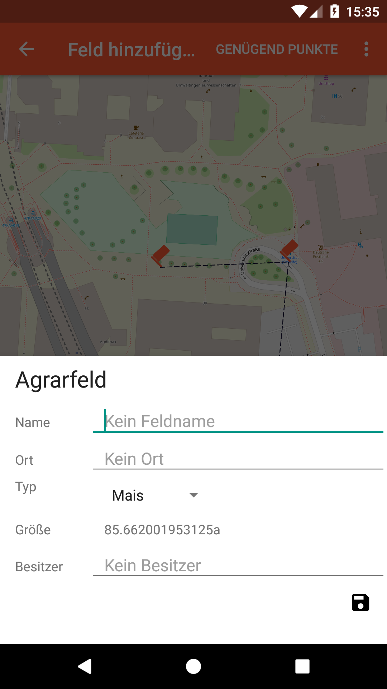
Nachdem klicken des Buttons „genügend Punkte“ können nun hier die Daten eingetragen werden

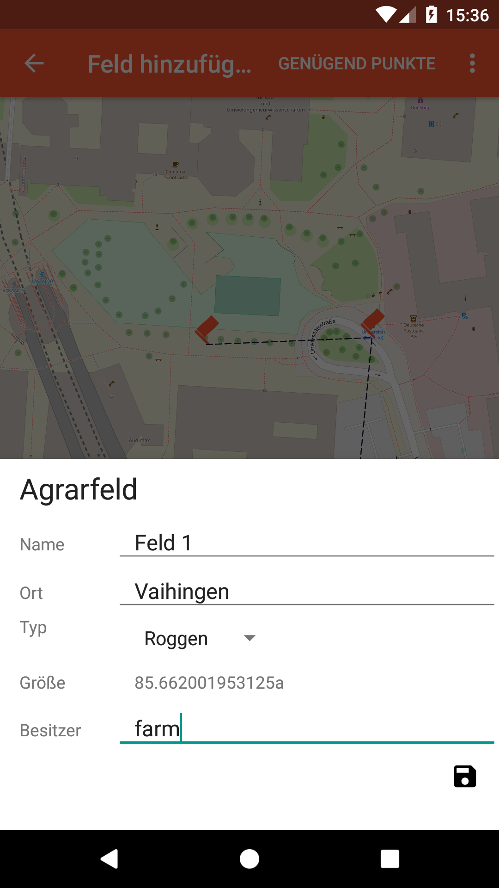
Alle Daten sind eingetragen. Nun kann man das Feld mit Hilfe des Diskettenicons speichern.

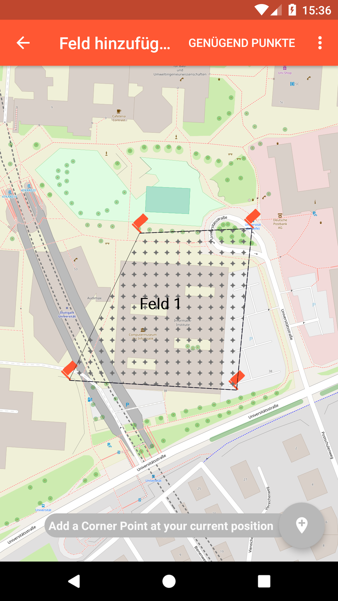
Ansicht des Feldes in der Add Activity

Nun kann wie gerade beschrieben ein weiteres Feld hinzugefügt werden. Wenn alle gewünschten Felder hinzugefügt worden sind kann mit dem Pfeil in der linken Ecke zurückgegangen werden

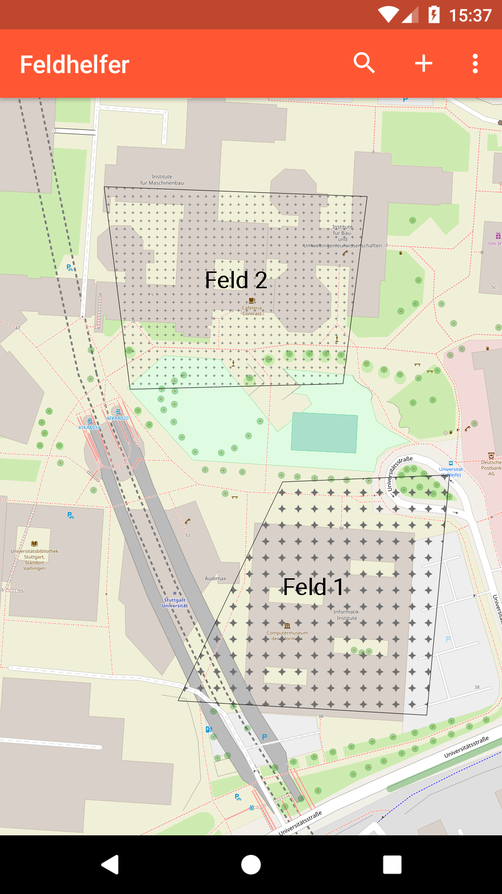
Hier sieht man nun die beiden Felder nach dem Verlassen der Add Activity. Hier können nun auch alle Felder angeklickt werden und bearbeitet werden

Nach dem Klicken auf das Feld kann es hier bearbeite werden (mit dem Stifticon), ein Schadensfall zum ausgewählten Feld hinzufügen  (mit dem Feuericon) oder mithilfe von Google Maps zum Feld navigieren

## Feature 2 Felder bearbeiten

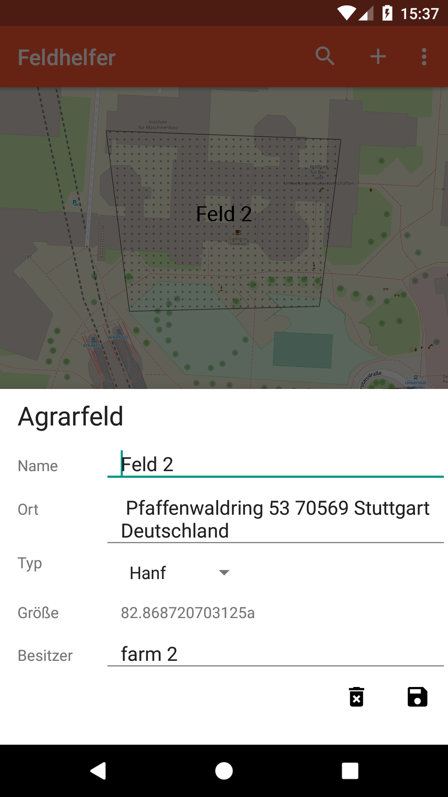
Hier kann Das Feld bearbeitet werden. Es können die meisten Daten geändert werden. Hier kann das Feld auch mithilfe des Mülltonnenicons gelöscht werden.

Hier wurden nun die Daten geändert und können mithilfe des Diskettenicons nun gespeichert werden.

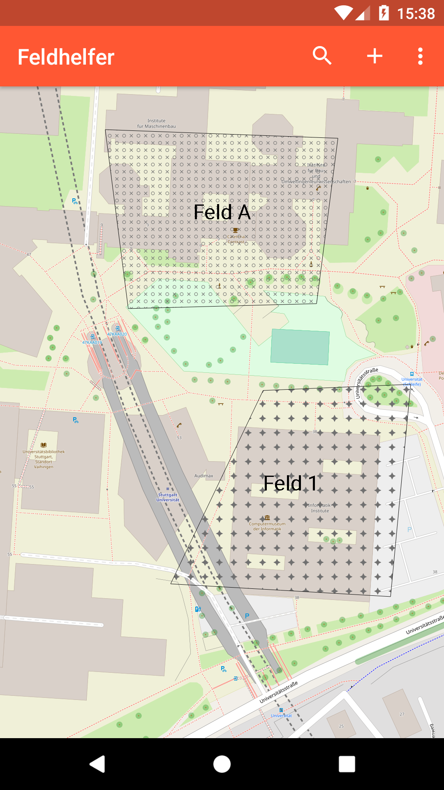
So sieht das Feld nun nach der Änderung aus

### Feature 3 Erstellen und Verwalten von Schadensfällen

Es können zu einem Feld Schadensfälle hinzugefügt oder entfernt werden. Das Hinzufügen und editieren läuft nahezu identisch ab wie bei Feature 1 beschrieben. Allerdings können hier noch Daten wie zum Beispiel das Entstehungsdatum des Schadens eigetragen werden oder Bilder vom Schaden angehängt werden. Hier werden nun hauptsächlich die Sachen erläutert die nicht identisch zum Felder hinzufügen/ändern sind.

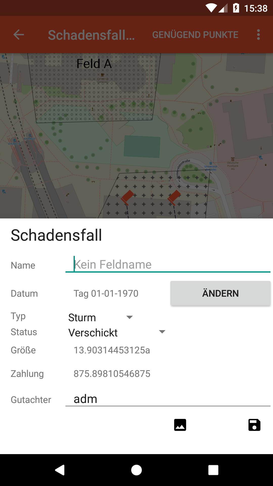
Das Eintragen eines Schadensfall läuft nach dem Klicken auf das Feuericon eines Feldes genauso ab wie das Hinzufügen eines Feldes. Nur die Dateneingabe ist umfasst andere Attribute. Weiter können hier über das Kamerasymbol noch Fotos hinzugefügt werden.

Datum auswählen wann der Schaden entstanden ist.

So könnte das ausgefüllte Formular aussehen.

Nachdem einfügen des Schadens.

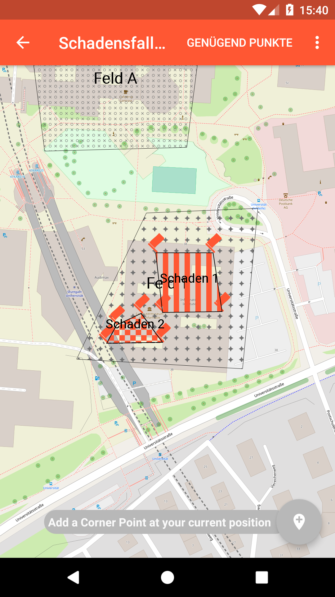
Auch hier können mehrere Schadensfälle direkt hintereinander eingefügt werden. Diese Schadensfälle sind unabhängig voneinander und müssen nur im gleichen Feld liegen. Hier die Ansicht von zwei Schadensfällen in einem Feld.

### Feature 4 Bilder zu einem Schadensfall hinzufügen

Wenn sich der Schadensfall im Bearbeitungsmodus befindet können auch Bilder zur besseren Dokumentation des Schadens hinzugefügt werden. Im Folgenden wird erklärt wie dies abläuft

Hier gibt es nun die Möglichkeit dem Bild einen Titel zu geben (der Titel kann auch leer gelassen werden). Man kann nun entweder ein Bild mit der Kamera machen oder eines aus der Galerie hinzuzufügen. Mit dem Rechtenesten Button wird das Fotomenü wieder geschlossen und es wird zur Kartenansicht zurückgegangen.

Hier wird ein Bild mit der Kamera gemacht.

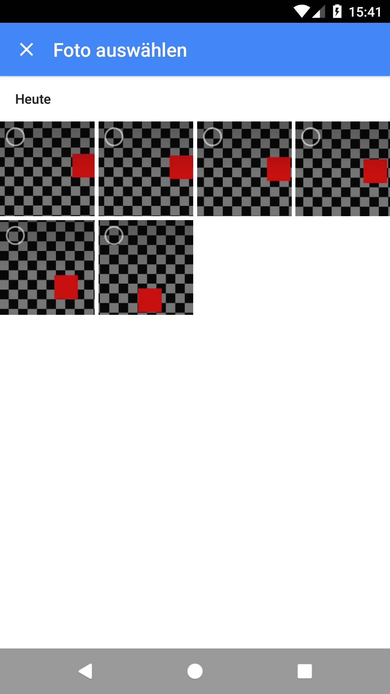
Hier kann ein Bild aus der Galerie ausgewählt werden.

Hier kann man die Bilder nun sehen wie sie eingefügt aussehen. Durch einfaches Klicken können Bilder auch wieder gelöscht werden (mit Sicherheitsabfrage).

Mit einem langen Klick auf das Bild kann das Bild gelöscht werden.

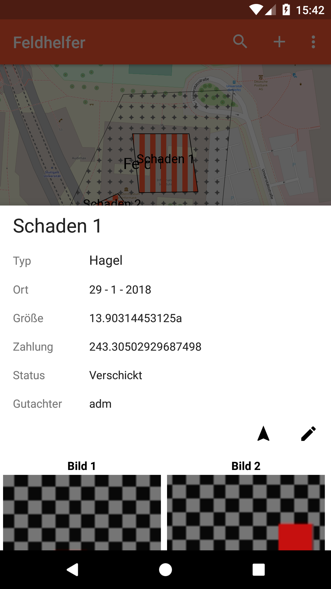

### Feature 5 Anzeigen aller Schadensfälle und Felder in einer Liste

Es wird ein Liste alle Schadensfälle und Felder sobald man auf den Button "list" drückt angezeigt. In dieser werden ein paar Informationen zu den Feldern und Schadensfällen angezeigt. Durch klicken auf einen Eintrag, werden alle Informationen die Verfügbar sind angezeigt und es wird zum jeweiligen Feld oder Schadensfall gezoomt. Es ist dann auch möglich den Eintrag zu bearbeiten und einen Schadensfall hinzuzufügen (Siehe Feature 1 und 2). Weiter sind in der Liste zuerst die Felder und dann die Schadensfälle aufgelistet

! [Liste aktivieren](doc/images/NachAnmelden2.png)
Hier kann die Liste ausgewählt werden.

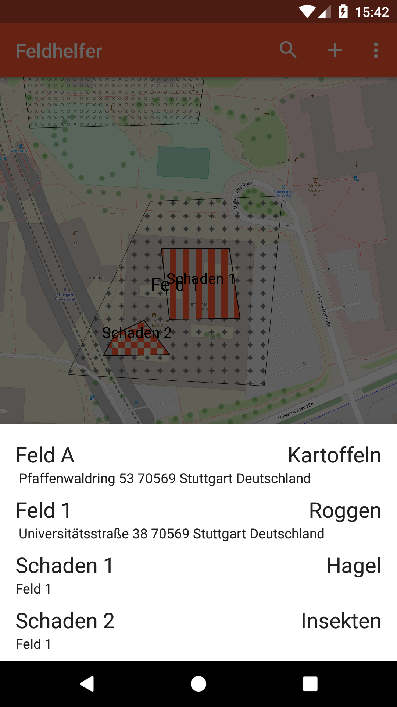
Anzeige der Liste mit den wichtigsten Informationen.

Detailansicht eines Feldes/Schadensfall nach dem klicken auf einen Eintrag in der Liste.

### Feature 6 Durchsuchen nach bestimmten Attributen

Ein durchsuchen der Felder und Schadensfälle nach Unterschiedliche Kriterien ist im Suchfeld möglich. Wenn ein oder mehrere passende Felder gefunden worden sind, werden diese wie in Feature 5 beschrieben angezeigt.

Aus diesen Kriterien kann der Nutzer die Suche beeinflussen

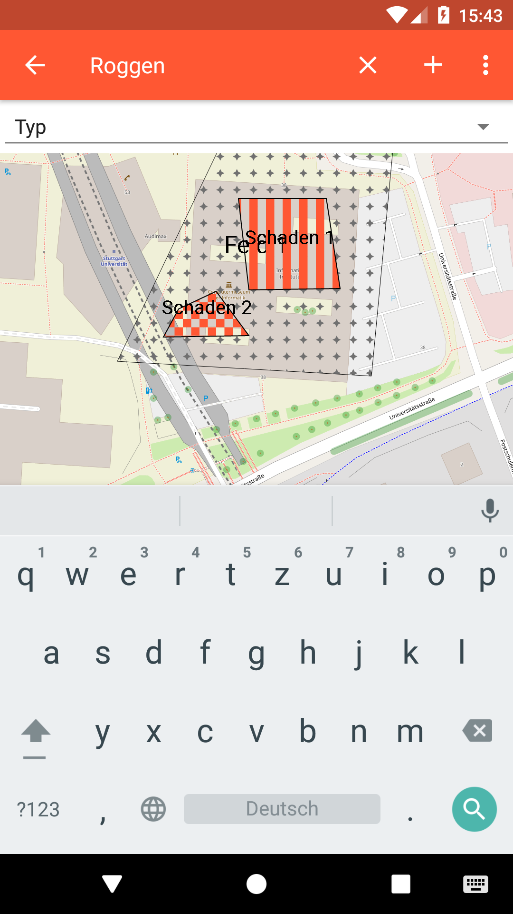
Suchfeld mit einer Eingabe.

Die gefundenen Treffer von der Suche.

### Feature 7 Die App ist eingeschränkt offline nutzbar

Ohne Internetverbindung ist es eventuell nicht möglich die Karte anzuzeigen. Weiter kann die Navigation per Google Maps nicht durchgeführt werden. Ansonsten sind alle Funktionen ohne Einschränkung nutzbar.

### Feature 8 Aktuellen Standort erfassen

Die App kann sobald einmal die Standorterfassung aktiviert ist, den Standort erfassen und diesen dann alle zwei Sekunden aktualisieren. Um dieses Feature nutzen zu können muss die Standorterfassung des Gerätes eingeschalten sein. Außerdem kann es einige Sekunden dauern bis ein Standort gefunden worden ist. In Gebäuden oder in Gebieten mit schlechten GPS-Empfang kann die Ortung eventuell nicht erfolgen.

Hier in diesem Menu lässt sich der Standortdienst aktivieren.

Anzeige des aktuellen Standorts.

### Feature 9 Navigation mit Google Maps
In der Detailansicht von Schadensfällen und Feldern ist es möglich über das Pfeilicon über Google Maps zu navigieren. Es wird ein Intent mit den Koordinaten des Mittelpunkte geöffnet. Hier kann dann wie gewöhnlich zum Feld navigiert werden, solange dorthin Wege existieren.

### Feature 10 Punkte manuell einzeichnen
Falls man nicht vor Ort die Felder eintragen will, kann man auch mit einfachen Klicks auf der Karte während einem  Feld oder Schadenfall hinzufügen die Eckpunkte des Feldes setzen.

### Feature 11 Nutzerverwaltung
Im Moment beschränkt sich die Nutzerverwaltung hauptsächlich darauf das Bauer und Verwalter unterschieden werden. Der Bauer hat keinerlei Schreibrechte. Kann also keine Felder oder Schadensfälle hinzufügen oder ändern. Er sieht nur Daten die auf seinen Namen laufen. Der Verwalter hingegen hat vollen Zugriff auf die App.

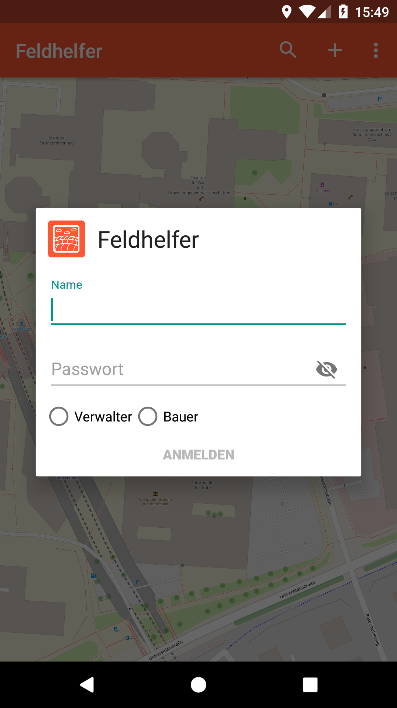
Hier können sich die Nutzer anmelden. Die Passwörte liegen verschlüsselt in der Datenbank. Eine Backend Lösung wäre hier sinvoller

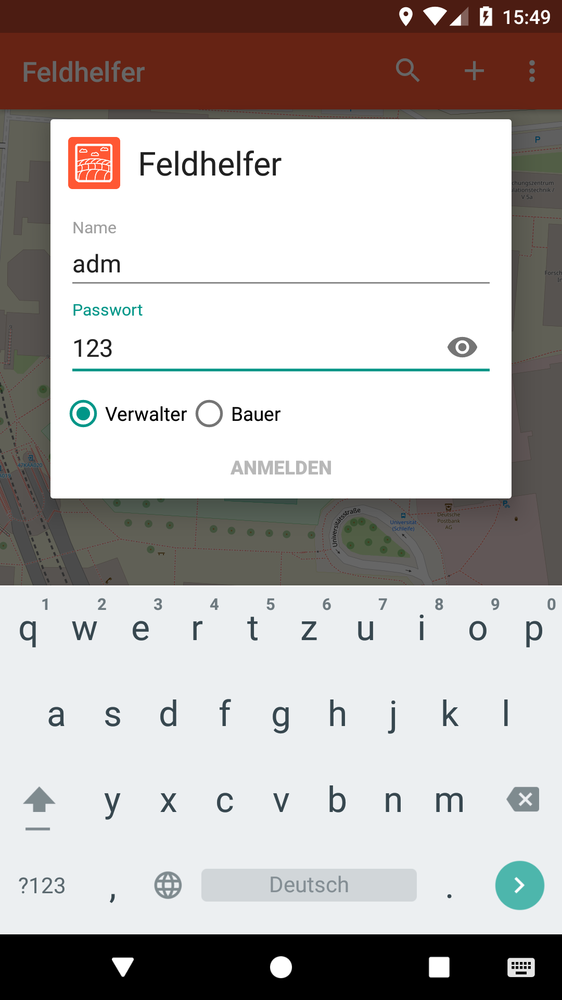
Eingetragene Login Daten.

Hier lässt sich einsehen wer gerade eingeloggt ist.

Ansicht eines beliebigen Verwalters.

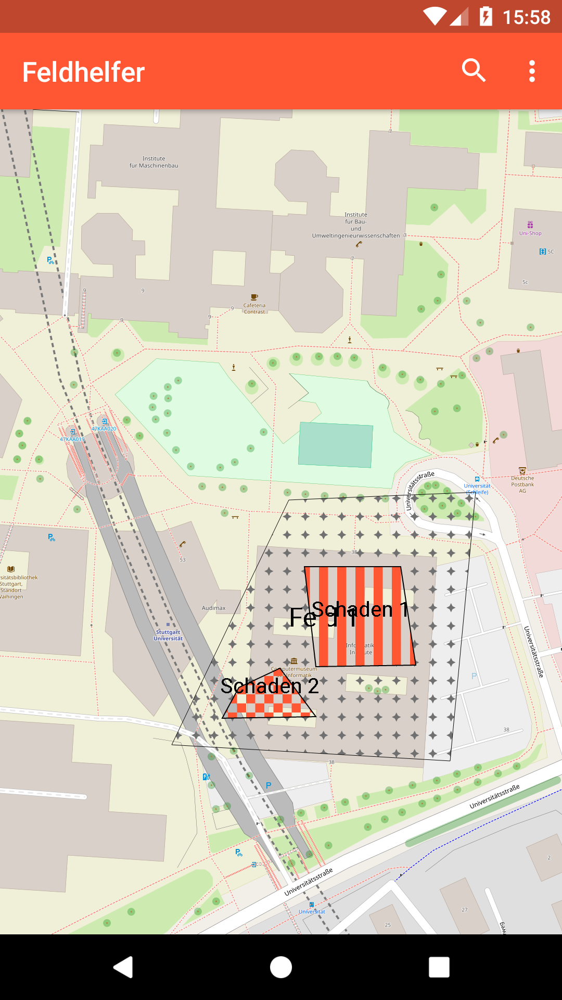
Hier ist die Ansicht wenn sich der Bauer farm eigeloggt hat.

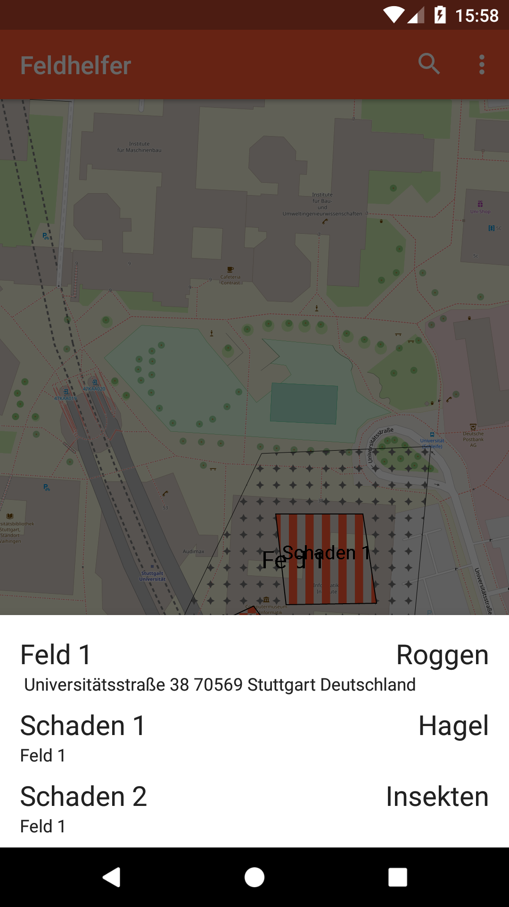
Liste der Felder mit Bauer farm als Benutzer.

### Feature 12 In App Tutorial
Mit Hilfe des Hilfe Buttons kann ein Tutorial aufgerufen werden das die grundlegenden Features der App zeigt

Hier eine exemplarische Darstellung eines Tutorialfensters.

## Installation
0. Deinstallieren sie eventuell alte Versionen von ihrem Smartphone bevor sie diese Version installieren.
1. Gehen sie in einen Ordner an dem sie die Daten der App laden wollen
2. Öffnen sie hier nun eine Konsole die mit Git-Befehlen arbeiten kann
3. Repository klonen: `git clone git@sopra.informatik.uni-stuttgart.de:sopra-ws1718/sopra-team-4.git`
4. geben sie nun den Benutzername und Passwort an das sie für den Zugriff bekommen haben
5. Nun schließen sie das Android Gerät an den PC und aktivieren an ihrem Handy eventuell noch die Dateiübertragung
6. Nun gehen sie in das gerade eben heruntergeladene Git-Repository und öffnen zusätzlich über den Explorer den Speicher des Smartphones und kopieren nun die .apk der App vom Repository in ihren Handyspeicher.
7. Nachdem das Kopieren abgeschlossen ist, gehen sie in die Einstellungen und dort zu Speicher & USB und wählen das Speichermedium aus auf den sie es übertragen haben. Wenn es auf den internen Speicher übertragen worden ist müssen sie nach dem auswählen noch auf "Erkunden" klicken.
8. Nun suchen sie die .apk der App und klicken darauf. Eventuell müssen sie noch in die Sicherheit Einstellung ihres Smartphone und die Einstellung für das installieren aus unbekannten Quellen erlauben.
9. Nun sollte sich ein Fenster öffnen in dem sie nur noch auf "Installieren" klicken müssen
10. Damit ist die Installation abgeschlossen

## Verwendung der App

### Wichtiger Anwendungsfall 1: Erstellung und Übersicht von Feldern
Der Gutachter kann Felder erstellen in dem er sie abläuft/abfährt und die passenden Daten einträgt. Dadurch hat auch der Bauer nochmal eine Übersicht was er an Feldern hat, wie groß diese sind oder was darauf angebaut wird. Diese Informationen können aber auch für die Versicherung interessant sein.

### Wichtiger Anwendungsfall 2: Erstellung von Schadensfälle durch einen Gutachter

Weiter kann ein Gutachter, der von einem geschädigten Bauer angerufen wird, über die App den Schaden schnell erfassen und alle notwendigen Daten eintragen. Dies ist genauer und schneller als wenn der Gutachter manuell die Positionsdaten des Schadens und alle anderen Daten per Papier erfassen müsste. Außerdem ist die Bearbeitung des Schadensfall einfacher, weil die Fälle sehr einfach weiter zu verschicken sind und somit auch schnell an eine Sachbearbeiter weitergleitet werden können.

### Wichtiger Anwendungsfall 3: Übersicht von Schäden für die Versicherung und Bauer
Die Versicherung bekommt somit eine gute Übersicht über die Felder mit Schadensfällen die ein Bauer hat. Weiter sieht sie alle Schadensfälle die eingetragen sind und kann diese dann abarbeiten und dem Bauer schnellstmöglich das Geld überweisen.
Aber auch der Bauer weiß somit genau wo der Schaden im Feld liegt und wie schlimm dieser ist. Außerdem bekommt er durch die einfacherer Bearbeitung seine Entschädigung schneller.

## Verwendete Bibliotheken

- osmdroid
- AppIntro

## Lizenz

Die Bedingungen der Lizenz können in [LICENSE](LICENSE) nachgelesen werden.
