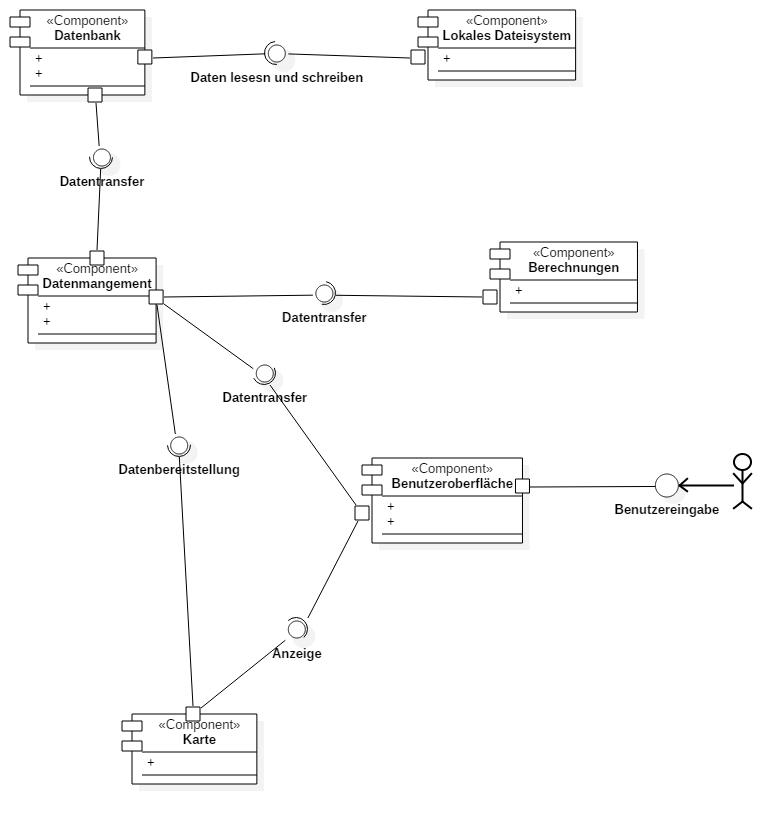
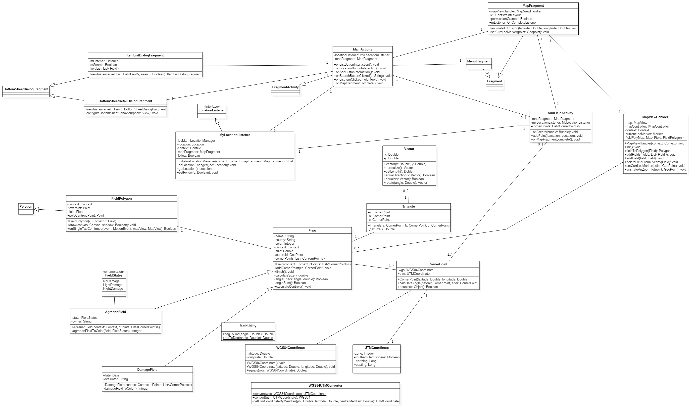
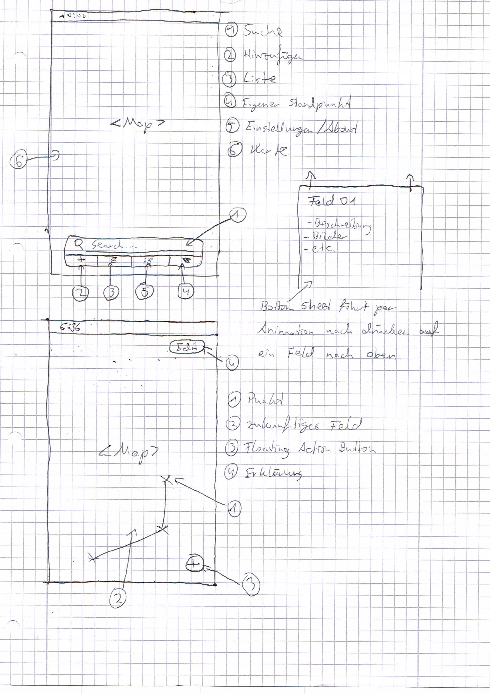
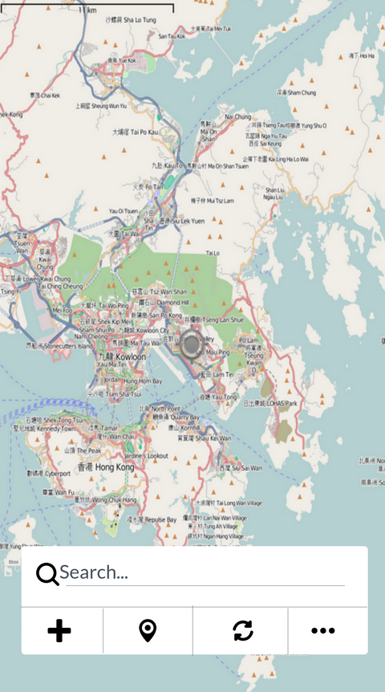
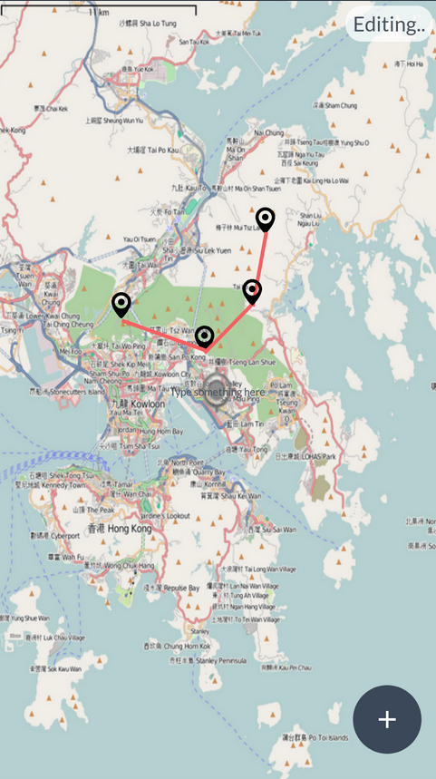
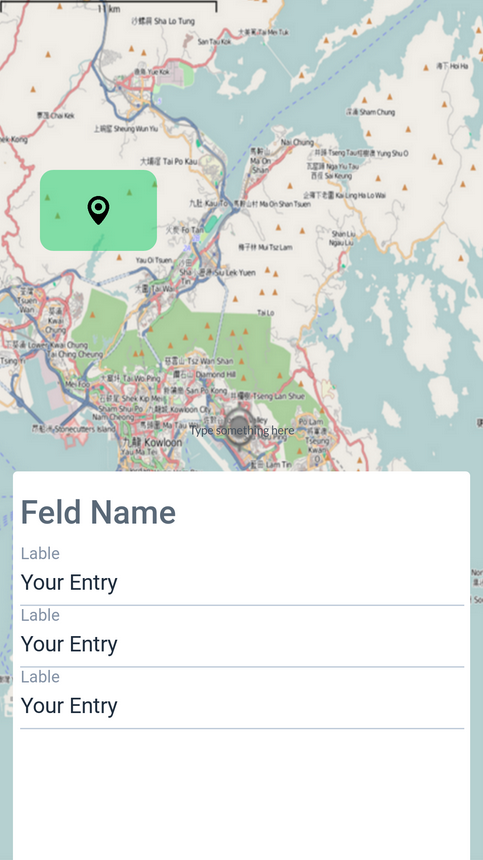
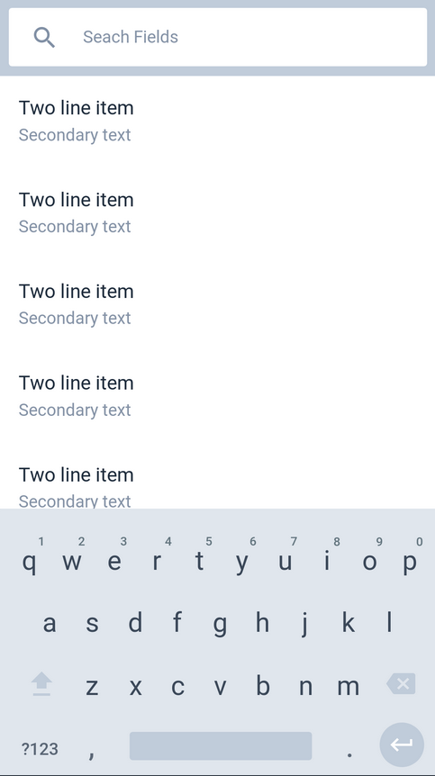

# Einführung

Der Benutzer soll mit der Benutzeroberfläche mit der App interagieren können. Die Benutzeroberfläche leitet alle Daten an das Datenmanagement weiter die der Nutzer hinzufügt. Der neue Datensatz wird nun vom Datenmanagement auf Vollständigkeit geprüft und eventuell zu brechende Daten werden von der Berechnungseinheit mithilfe der eingegebenen oder bereits vorhandenen Daten berechnet. Sobald die für einen Eintrag benötigten Daten alles berechnet ist wird dieser in die Datenbank eingefügt. Diese Datenbank wird auf dem Speicher des Geräts abgelegt. Fordert der Nutzer nun über die Benutzeroberfläche einen Datensatz an, wird dieser Auftrag weiter an das Datenmanagement geleitet. Von das aus wird der Auftrag an die Datenbank gegeben der dann die Daten aus dem Speicher liest und an das Datenmanagement zurückgibt. Diese bereitet die Daten eventuell noch für den Nutzer auf und gibt eventuell noch eine nötige Berechnung in Auftrag. Sobald alle gewünschten Daten vorhanden sind werden diese über die Benutzeroberfläche den Benutzer angezeigt.
# Komponentendiagramm

Komponentendiagramm

## Beschreibung der Komponenten

## Lokales Dateisystem

Unsere Datenstruktur wird von der Komponente Lokales Dateisystem von der Datenbank empfangen und dann auf den Speicher geschrieben oder aus dem Speicher gelesen und an die Datenbank gesendet.

## Datenbank

Speichert alle Daten wie Positionsdaten der Felder, Details zu den Schadensfällen usw. in einer noch nicht sicher festgelegten Form.

## Datenmanagement

Holt die Daten aus der Datenbank und stellt sie der Berechnung, der Karte und der Benutzeroberfläche zur Verfügung. Weiter empfängt sie Daten von den eben genannten Komponenten und speichert dieser an die richtige Stelle in der Datenbank.

## Berechnungen

Realisiert jegliche Berechnungen die für die Felder und Schadensfälle nötig sind und nimmt die Daten aus dem Datenmanagement und gibt sie wieder an diese zurück.

## Benutzeroberfläche

Mit dieser Komponente kommt der Benutzer direkt in Berührung. Hier werden die Daten von ihm eigetragen und können von ihm ausgelesen werden. Die Daten werden an das Datenmanagement gesendet und empfangen. Weiter kann der Benutzer die Karte bedienen. Diese Interaktionen werden dann an die Karte weitergeleitet

## Karte

Diese Komponente ist für die Anzeige der Karte und der berechneten Polygone zuständig. Die Daten für die Polygone werden vom Datenmanagement zur Verfügung gestellt. Weiter werden die Interaktionen die der Nutzer über die Oberfläche auf der Karte macht von der Karte empfangen und dementsprechend die Anzeige angepasst.

# Klassendiagramm

Klassendiagramm

## Beschreibung der wichtigen Klassenhierarchie 

## Beschreibung der Klasse User
Diese Klasse ist entweder vom Typ Landwirt oder vom Typ Gutachter, durch sie erfährt die App
welcher Benutzertyp aktiv ist.

## Beschreibung der Klasse Landwirt
Ein Landwirt besitzt 0..* Felder und kann als User "Landwirt" die App verwenden.

## Beschreibung der Klasse Gutachter
Die Klasse Gutachter hat 0..* Landwirte und kann ebenfalls als Nutzer die App verwenden.

## Beschreibung der Klasse 
Ein Feld besitzt einen oder keinen Schadensfall und 3..* Punkte, damit ein Polygon erstellt werden kann. 

## Beschreibung der Klasse Schadensfall
Ein Schadensfall kann 0..* Fotos besitzen und ist ein Attribut in der Klasse Feld.

## Beschreibung der Klasse Foto
Diese Klasse beinhaltet ein Foto das in einem Schadensfall vorhanden sein kann.

## Beschreibung der Klasse DataController
Der DataController kümmert sich um die intern verwendeten Daten und leitet diese weiter.

## Beschreibung der Klasse DataReader 
Diese Klasse liest Daten aus dem internen Speicher.

## Beschreibung der Klasse DataWriter
Diese Klasse schreibt Daten auf den internen Speicher 

## Beschreibung der Klasse MainActivity
Die Haupt Activity der Android App, sie gibt die im internen Speicher hinterlegten Daten an die UI weiter.

## Beschreibung der Klasse MapFragment
Eine Teil Activity die sich um die Kontrolle eines Teils der UI kümmert und Daten weiterreicht.

## Beschreibung der Klasse BottomSheetFragment
Eine UI Komponente die über ein sogenanntes Bottom Sheet eine Liste von Feldern oder eine Detailansicht eines Felder darstellen kann.

## Beschreibung der Klasse BSList
Ein BottomSheetFragment vom Typ Liste.

## Beschreibung der Klasse BSDetail
Ein BottomSheetFragment vom Typ Detail.

## Beschreibung der Klasse MapController 
Diese Klasse kontrolliert den MapView und dessen Inhalte.

## Beschreibung der Klasse MapView
Kümmert sich um die grafische Darstellung der Karte und deren Inhalte.

## Beschreibung der Klasse MenuBarFragment
Diese Klasse stellt das Menu im unteren Bildschirmteil dar und kümmert sich um Events die durch das Menu ausgelöst werden.

## Beschreibung der Klasse AddFieldActivity
Eine eigene Activity die den User neue Felder hinzufügen lässt. Sie kommuniziert mit der Klasse DataController um die hinzugefügten Daten im Speicher abzulegen.

# handschriftliche GUI-Skizze mit Erläuterungen

Handschriftliche GUI-Skizze der App mit zusätzlichen Informationen.

# weitere GUI Mockups

Mockup des Startbildschirms.

__________

Mockup für ein erstellen und editieren eines Feldes.

______________

Mockup von der Darstellung eines Feldes oder Schadensfall mit den dazugehörigen Daten.

___________

Mockup der Suche nach einem Feld oder auch andere Eigenschaften. Inclusive Suchvorschlägen.
_______