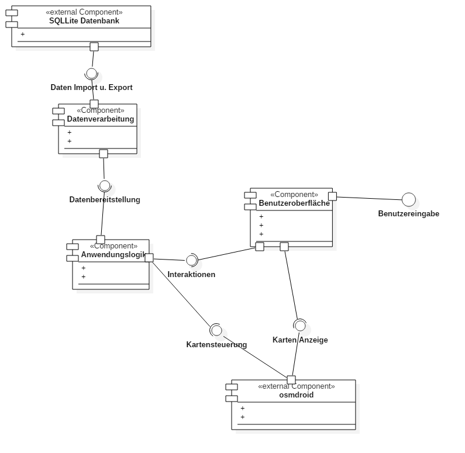

# Einführung

Der Benutzer soll mit der Benutzeroberfläche mit der App interagieren können. Die Benutzeroberfläche leitet alle Daten an das Datenmanagement weiter die der Nutzer hinzufügt. Der neue Datensatz wird nun vom Datenmanagement auf Vollständigkeit geprüft und eventuell zu brechende Daten werden von der Berechnungseinheit mithilfe der eingegebenen oder bereits vorhandenen Daten berechnet. Sobald die für einen Eintrag benötigten Daten alles berechnet ist wird dieser in die Datenbank eingefügt. Diese Datenbank wird auf dem Speicher des Geräts abgelegt. Fordert der Nutzer nun über die Benutzeroberfläche einen Datensatz an, wird dieser Auftrag weiter an das Datenmanagement geleitet. Von das aus wird der Auftrag an die Datenbank gegeben der dann die Daten aus dem Speicher liest und an das Datenmanagement zurückgibt. Diese bereitet die Daten eventuell noch für den Nutzer auf und gibt eventuell noch eine nötige Berechnung in Auftrag. Sobald alle gewünschten Daten vorhanden sind werden diese über die Benutzeroberfläche den Benutzer angezeigt.
# Komponentendiagramm

Komponentendiagramm

## Beschreibung der Komponenten

## LSQLLite Datenbank

Die Daten, die die App erstellt sollen in einer SQLLite Datenbank gespeichert werden und auf dem internen Speicher abgelegt werden. Daten die dort abgelegt werden sollen sind zum Beispiel die Geodaten der Felder und Schadensfälle, verschiedene beschreibende Attribute, wie Name des Bauer oder Gutachter, etc. Die Datenbank stellt die Daten über ihrer Schnittstelle zur Verfügung und bekommt über diese auch die zu schreibenden Daten.

## Datenverarbeitung

Die Datenverarbeitung nimmt die zu speichernden Objekte entgegen und wandelt diese in speicherbare Formate um. Weiter greift sie mithilfe von SQLLitebefehlen auf die Datenbank zu und liest und schreibt damit die Daten. Die eingelesenen Daten werden dann wieder in die passenden Objekte gepackt und der Anwendungslogik bereit gestellt.

## Anwendungslogik

Die Anwedungslogik ist das Herzstück der App. Sie bekommt die Daten von der Benutzerschnittstelle und verabeitet diese. Hierrunter fällt zum Beispiel die Berechnung der Feldgröße, die Erfassung der GPS-Signale, die Erstellung der Polygone, etc.
Weiter gibt sie die benötigten Daten an die osmdroird Karte (z.B die bereits erstellten Polygone) weiter und empfängt von dieser Klicks auf eine Polygonfläche.
Ebenfalls leitet sie die zu speichernden Objekte an die Datenverarbeitung weiter und bekommt von dieser auch die benötigeten Objekte vorherigen Sitzungen.

## Benutzeroberfläche

Mit dieser Komponente kommt der Benutzer direkt in Berührung. Hier werden die Daten von ihm eigetragen und können von ihm ausgelesen werden. Die Daten werden an die Anwendungslogik gesendet und empfangen. Hier befinden sich auch alle Bedienelemente mit der der Benutzer die App bedienen soll. Weiter werden die Steuerungsbefehle an die OpenStreetMap weitergegeben und die Anzuzeigende Karte empfangen.
## Osmdroid

Diese Komponente empfängt die Polygondaten die angezeigt werden sollen. Weiter gibt sie eventuelle Positionsdaten zurück die aufgrund einer Interaktion mit der Karte erzeugt werden. Außerdem liefert sie die Daten für die Anzeige an die Benutzeroberfläche und empfängt von dieser Steuersignale, wie zum Beispiel bewegen der Karte oder Zoomen.

# Klassendiagramm

Klassendiagramm

## Beschreibung der wichtigen Klassenhierarchie 

Zur besseren Übersicht wird auf Getter- und Settermethoden und auf Android Methoden wie "OnCreate" verzichtet.

## Beschreibung der Klasse Field

## Beschreibung der Klasse AgrarianField

## Beschreibung der Klasse DamageField

## Beschreibung der Klasse FieldPolygon

## Beschreibung des Enum FieldStates

## Beschreibung der Klasse Vector

## Beschreibung der Klasse Triangle

## Beschreibung der Klasse CornerPoint

## Beschreibung der Klasse UTMCoordinate

## Beschreibung der Klasse WGS84Coordinate

## Beschreibung der Klasse WGS84UTMConverter

## Beschreibung der Klasse MathUtility

## Beschreibung der Klasse ItemListDialogFragment

## Beschreibung der Klasse DetailDialogFragment

## Beschreibung der Klasse MyLocationListener

## Beschreibung der Klasse MainActivity

## Beschreibung der Klasse MapFragment

## Beschreibung der Klasse MapViewHandler

## Beschreibung der Klasse AddFieldActivity

## Beschreibung der Klasse User

## Beschreibung der Klasse Bauer

## Beschreibung der Klasse Gutachter

# handschriftliche GUI-Skizze mit Erläuterungen

Handschriftliche GUI-Skizze der App mit zusätzlichen Informationen.

# weitere GUI Mockups

Mockup des Startbildschirms.

__________

Mockup für ein erstellen und editieren eines Feldes.

______________

Mockup von der Darstellung eines Feldes oder Schadensfall mit den dazugehörigen Daten.

___________

Mockup der Suche nach einem Feld oder auch andere Eigenschaften. Inclusive Suchvorschlägen.
_______