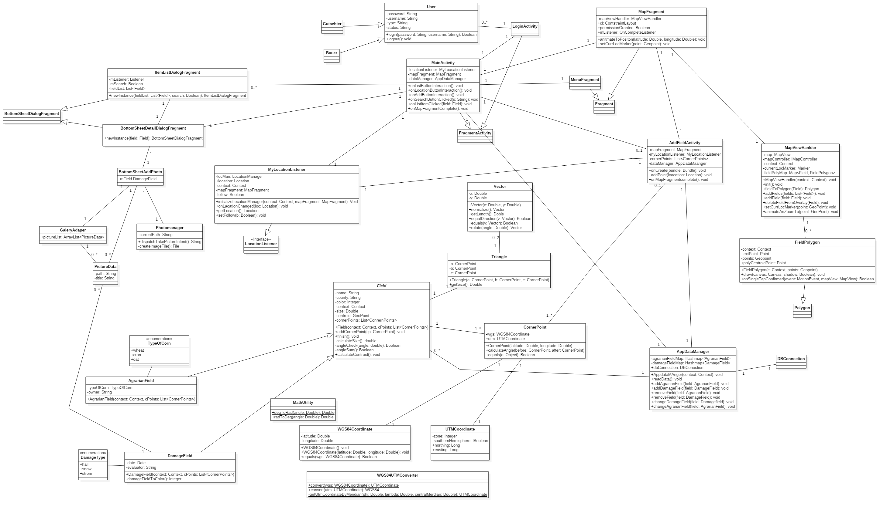

# Einführung

Grundlegend soll eine Drei-Schichten Architektur vorliegen.
Die Benutzeröberfläche soll nur Daten anzeigen die sie bekommt und nur Daten weiterleiten. Sie soll vorallem keine Berechnungen durchführen.
Die Anwendungslogik soll alle Berechnungen und Bearbeitungen durchführen die anfallen. Zum Beispiel die Erstellung eines neuen Feldes oder die Bearbeitung eines Schadensfal.
Die Datenverabeitung soll die von der Anwendugslogik erstellten Daten an eine SQLLite Datenbankd senden und angefragte Daten von dieser Empfangen.

# Komponentendiagramm

Komponentendiagramm

## Beschreibung der Komponenten

## LSQLLite Datenbank

Die Daten, die die App erstellt sollen in einer SQLLite Datenbank gespeichert werden und auf dem internen Speicher abgelegt werden. Daten die dort abgelegt werden sollen sind zum Beispiel die Geodaten der Felder und Schadensfälle, verschiedene beschreibende Attribute, wie Name des Bauer oder Gutachter, etc. Die Datenbank stellt die Daten über ihrer Schnittstelle zur Verfügung und bekommt über diese auch die zu schreibenden Daten.

## Datenverarbeitung

Die Datenverarbeitung nimmt die zu speichernden Objekte entgegen und wandelt diese in speicherbare Formate um. Weiter greift sie mithilfe von SQLLitebefehlen auf die Datenbank zu und liest und schreibt damit die Daten. Die eingelesenen Daten werden dann wieder in die passenden Objekte gepackt und der Anwendungslogik bereit gestellt.

## Anwendungslogik

Die Anwedungslogik ist das Herzstück der App. Sie bekommt die Daten von der Benutzerschnittstelle und verabeitet diese. Hierrunter fällt zum Beispiel die Berechnung der Feldgröße, die Erfassung der GPS-Signale, die Erstellung der Polygone, etc.
Weiter gibt sie die benötigten Daten an die osmdroird Karte (z.B die bereits erstellten Polygone) weiter und empfängt von dieser Klicks auf eine Polygonfläche.
Ebenfalls leitet sie die zu speichernden Objekte an die Datenverarbeitung weiter und bekommt von dieser auch die benötigeten Objekte vorherigen Sitzungen.

## Benutzeroberfläche

Mit dieser Komponente kommt der Benutzer direkt in Berührung. Hier werden die Daten von ihm eigetragen und können von ihm ausgelesen werden. Die Daten werden an die Anwendungslogik gesendet und empfangen. Hier befinden sich auch alle Bedienelemente mit der der Benutzer die App bedienen soll. Weiter werden die Steuerungsbefehle an die OpenStreetMap weitergegeben und die Anzuzeigende Karte empfangen.
## Osmdroid

Diese Komponente empfängt die Polygondaten die angezeigt werden sollen. Weiter gibt sie eventuelle Positionsdaten zurück die aufgrund einer Interaktion mit der Karte erzeugt werden. Außerdem liefert sie die Daten für die Anzeige an die Benutzeroberfläche und empfängt von dieser Steuersignale, wie zum Beispiel bewegen der Karte oder Zoomen.

# Klassendiagramm

Klassendiagramm

## Beschreibung der wichtigen Klassenhierarchie

Zur besseren Übersicht wird auf Getter- und Settermethoden und auf Android Methoden wie "OnCreate" verzichtet.

## Beschreibung der Klasse Field

In dieser Klasse werden die Daten von Feldern und Schadensfällen gespeichert bzw. erstellt. Hier wird vorallem die Berechnung der Feldgröße erledigt. Weiter werden die Daten die für einen Schadensfall und einem Feld gleich sind defniert. Außerdem wird hier auch der Mittelpunkt des Feldes/Schadenfall berechnet.

## Beschreibung der Klasse AgrarianField

In dieser Klasse wird noch zusätzlich gespeichert was auf dem Feld im Moment angebaut wird und das Feld dementsprechend farblich angepasst.

## Beschreibung der Klasse DamageField

Hier werden hauptsächlich zusätzliche Daten zu einem Schadensfall gespeichert, wie z.B. das Datum wann ein Schaden entstanden ist.

## Beschreibung der Klasse FieldPolygon

Diese Klasse ist dafür zuständig das Polygon von einem Feld/Schadensfall auf der Map mit den passenden Eckpukten zu zeichnen.

## Beschreibung des Enum TypeOfCorn

Hier werden die verschiednen Feldfrüchte definiert.

## Beschreibung der Klasse Vector

In dieser Klasse werden Grundlegende Vector Berechnungen defniert. Zum Beispiel Normalisierung oder ob sie in die gleiche Richtung zeigen.

## Beschreibung der Klasse Triangle

Hier wird die Fläche eines Dreiecks berechnet die von der Berechnung der Größe des Feldes nötig ist. Dafür wird der Abstand mithilfe der UTM Koordinaten berechnet.

## Beschreibung der Klasse CornerPoint

Hier werden die Positionsdaten abgelegt

## Beschreibung der Klasse UTMCoordinate

Hier werden die Koordinaten der Punkte im UTM-Format gespeichert

## Beschreibung der Klasse WGS84Coordinate

Hier werden die Koordinaten der Punkte im WGS84-Format gespeichert

## Beschreibung der Klasse WGS84UTMConverter

Hier werden WGS84 Kordinaten in UTM Koordinaten umgerechnet. Ebenfalls in die andere Richtung.

## Beschreibung der Klasse MathUtility

Einige Hilfmethoden werden hier defniert, wie zum Beispiel die Umrechnung von  Grad in Bogenmaß oder Bogenmaß in Grad oder die Berechnung des Skalarprodukts.

## Beschreibung der Klasse ItemListDialogFragment

Diese Klasse gibt die Daten der Felder und Schadensfälle als Liste auf dem Display aus und kann bei Bedarf geändert werden oder es können Schadensfälle hinzugefügt werden.

## Beschreibung der Klasse BottomSheetDetailDialogFragment

Diese Klasse erzeugt die Anzeige wenn man auf ein Feld oder Schadensfall klickt. Diese zeigt dann die Daten an die hinterlegt sind (z.B Größe des Feldes, Name des Gutachter, etc).

## Beschreibung der Klasse MyLocationListener

In dieser Klasse werden die Standort Daten des GPS-Sensors erfasst und falls dieser nicht zur Verfügung steht wird der Standort anhand des aktuellen Netzwerkstandort ermittelt. Der ermittelte Standort kann dann von andere Klassen abgerufen werden. 

## Beschreibung der Klasse MainActivity

Diese Klasse ist der Startpunkt des Programms. Von hier werden alle UI Komponenten geladen.

## Beschreibung der Klasse MapFragment

Diese Klasse komuniziert mit dem MapViewHanlder und der MainActivity. Weiter werden hier die Permissions vom Speicher Zugriff um die Map zu laden und um die Standortdaten abrufen zu können abgefragt.

## Beschreibung der Klasse MapViewHandler

Diese Klasse stellt die Methoden zur KArteninteraktion bereit. Hier kann zu einer gegebenen Position animiert werden, ein Marker mit der aktuellen Position gesetzt werden und es werden die einzelnen Overlays die von FieldPolygon erzeugt werden auf die Karte gesetzt oder gelöscht.

## Beschreibung der Klasse AddFieldActivity

Diese Klasse stellt eine neue Acitvity. Mit dieser ist es möglich neue Felder und Schadensfälle zu erstellen. Hier können die Eckpunkte per GPS eingetragen werden und die benötigten Informationen (z.B. Namen des Gutachter oder Bauer, Datum, etc).

## Beschreibung der Klasse User

Diese Klasse soll die Nutzervewaltung regeln. Sie stellt login, logout und status methoden bereit und speichert Passwörter und Nutzernamen.

## Beschreibung der Klasse Bauer

Diese Klasse regelt die Zugriffsbeschränkung die man als Bauer in der App hat. zum Beispiel das ein Bauer nur auf seine eigenen Felder zugreifen kann.

## Beschreibung der Klasse Gutachter

Siehe Klasse Bauer

# handschriftliche GUI-Skizze mit Erläuterungen

Handschriftliche GUI-Skizze der App mit zusätzlichen Informationen.

# weitere GUI Mockups

Mockup des Startbildschirms.

__________

Mockup für ein erstellen und editieren eines Feldes.

______________

Mockup von der Darstellung eines Feldes oder Schadensfall mit den dazugehörigen Daten.

___________

Mockup der Suche nach einem Feld oder auch andere Eigenschaften. Inclusive Suchvorschlägen.
_______