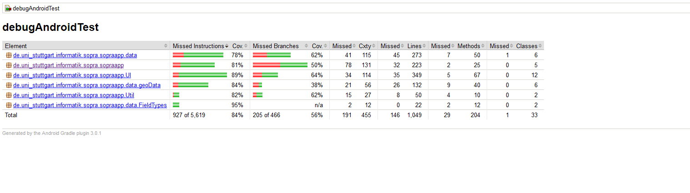

# Sprint Report 2

In diesem Sprint wurde die Useability von den Critical Features erheblich verbessert und opitmiert.
Folgende Additional Features wurden implmentiert:
- [Hinzufügen eines Eckpunktes per Touchdisplay](sopra-ws1718/sopra-team-4#91)
- [User Verwaltung](sopra-ws1718/sopra-team-4#73)
- [Unterstützung von verschiednen Sprachen](sopra-ws1718/sopra-team-4#86)
- [Navigation zu den Feldern via Google Map](sopra-ws1718/sopra-team-4#88)
- [Status für Schadensfälle](sopra-ws1718/sopra-team-4#80)
- [Fotos von Schadensfällen hinzufügen und anzeigen](sopra-ws1718/sopra-team-4#47)

## Verbesserte Dokumente

- Product Backlog
- Issues in GitLab
- Entwurf
 	- Klassendiagramm und Beschreibungen angepasst
- Readme
- License

## Tests/Testprotokolle/Nachweis der Testabdeckung

Testabdeckung der App

Genauere Details befinden sich in der Datei TestCoverage/TestCoverage.html .
